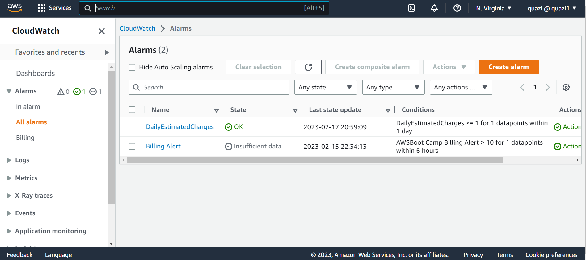

# Week 0 — Billing and Architecture
## Required Homework

### Recreate Conceptual diagram on napkin a napkin
I have create a conceptual diagram of Cruddur on a napkin and uploated the proof in assests folder.

### Recreate Logical Acrhitectural Diagram in Lucid
I have successfully created the Cruddur Logiacal Diagram in Lucid and also uploaded the proof.

[Lucid chart share link](https://lucid.app/lucidchart/96d83b12-1f5a-4f8b-9324-2200fef66865/edit?viewport_loc=-160%2C1248%2C2133%2C773%2C0_0&invitationId=inv_da26d3a7-efa1-447c-afa2-27032d289503)

### Installing AWS CLI
I have successfully able to install AWS CLI in my gitpod environment
Updated my.gitpod.yml to include the following task.
tasks:
  - name: aws-cli
    env:
      AWS_CLI_AUTO_PROMPT: on-partial
    init: |
      cd /workspace
      curl "https://awscli.amazonaws.com/awscli-exe-linux-x86_64.zip" -o "awscliv2.zip"
      unzip awscliv2.zip
      sudo ./aws/install
      cd $THEIA_WORKSPACE_ROOT

Checked the working of AWS CLI using:
  aws sts get-caller-identity
      

### Create a Billing Alarm
First enabled the billing alert to get the alert.
Then created the SNS Topic using :
  aws sns create-topic --name billing-alarm
 Using the retrived TopicARN , created the subscription which is the confirmed through the email recievd on my email-id.
 Finally cofigured the alarm,
  aws cloudwatch put-metric-alarm --cli-input-json file://aws/json/alarm_config.json

### Create a Budget
I was able to successfully create a budget using AWS CLI
aws budgets create-budget \
    --account-id AccountID \
    --budget file://aws/json/budget.json \
    --notifications-with-subscribers file://aws/json/budget-notifications-with-subscribers.json

## Homework Challenges
Reviewed all the question of each pillars in the Well-Architected Tool.
Followed the link 
[Refrence](https://us-east-2.console.aws.amazon.com/wellarchitected/home?region=us-east-2#/)
