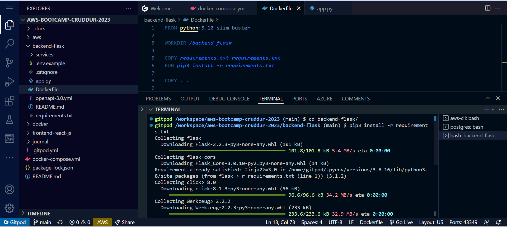
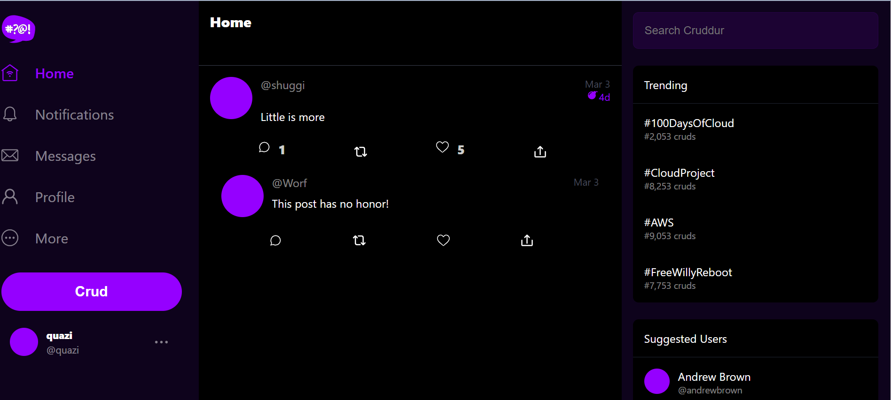
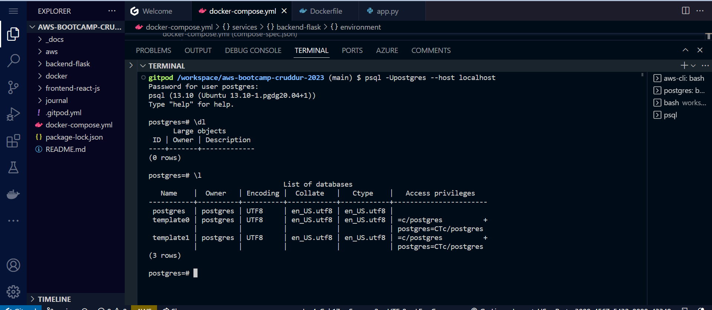

# Week 1 — App Containerization

## Required Homework

### Configured Gitpod.yml configuration successfully 

Containerize Backend
  cd backend-flask
export FRONTEND_URL="*"
export BACKEND_URL="*"

## Add Dockerfile ##
      FROM python:3.10-slim-buster
      WORKDIR /backend-flask
      COPY requirements.txt requirements.txt
RUN pip3 install -r requirements.txt

 

Set Environment Varables
        ENV FLASK_ENV=development

python3 -m flask run --host=0.0.0.0 --port=4567

EXPOSE ${PORT}
CMD [ "python3", "-m" , "flask", "run", "--host=0.0.0.0", "--port=4567"]

### Build Container ###
      docker build -t  backend-flask ./backend-flask

### Run Container###
   FRONTEND_URL="*" BACKEND_URL="*" docker run --rm -p 4567:4567 -it backend-flask   
 
 
 ### Docker images ###
 
 
 
### Containerized Frontend ###
run npm i
copy frontend file contents and paste into frontend docker file
 
### Ensured apps running locally successfully ###
 
 ### Created a docker-compose yml file- allow us to run multiple containers same time ###
 docker-compose up 
 Backend and Frontend talking
  
 
 ### Created Notification successfully ###
 
 
 ### Adding DynamoDB Local and Postgres ###
 
 DynamoDB Local
 
 
 
###  Postgres ###
 
 
## OUTCOME ##
Gained practical knowledge working with common docker command and running container images for the purpose of local development
Gained practical knowledge of working within a Cloud Development environment
Be able to navigate a backend and front web-application and generally understand how they work 

